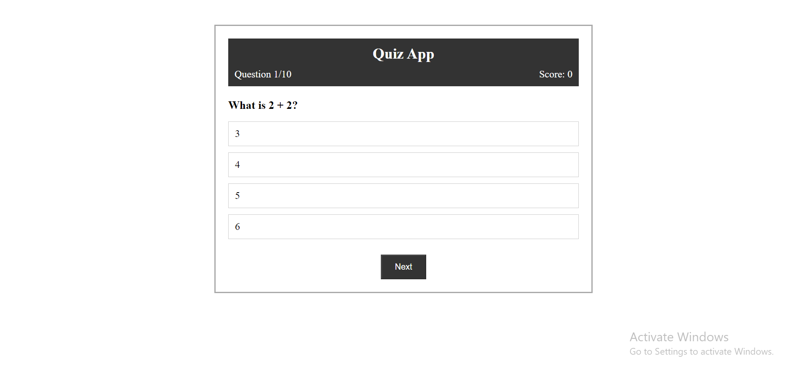

## Quiz App

In this project user has to create a simple quiz application, where one can test his skills.

## Features

- Button to start the quiz.
- User can see that the attended questions answer is correct or not.
- User can see his score card.
- User can restart the game after completion.

## Tech Used

- HTML
- CSS
- JavaScript

## Output

